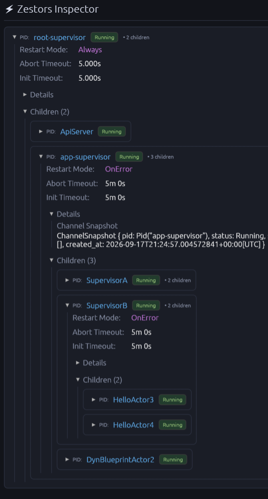

# zestors

[](https://crates.io/crates/zestors)
[](https://docs.rs/zestors)

`zestors` is an actor framework for Rust with Erlang/OTP-style supervision.

An actor is a just a `tokio` task that owns an `Inbox` and processes messages.
Messages are defined as plain structs deriving `Message`, and grouped into an
`Interface` that defines the messages an `Actor` accepts. Actors can also be supervised: a `Supervisor` starts, watches, and restarts a set of children according to its restart strategy. A `Node` then runs a root supervisor as an entire program, shutting it down gracefully on Ctrl+C/SIGTERM.

This repository is a Cargo workspace; most consumers should depend on the
[`zestors`](crates/zestors) facade crate, which re-exports the other crates
as modules.

## Philosophy
Zestors was written from the ground up with a couple of core ideas in mind, that
guided it's evolution
- **Messages define the contract**: A message should by itself define how an actor responds to it, thereby making the interface of an actor define exactly how an actor behaves.
- **Bring your own event-loop**: While for most cases, it's fine to just implement  `Handle` for all accepted messages, more complex actors will want to write their own event-loops for more control.
- **Flexibility**: Make it possible to swap out or use only the parts that you need. Easily write custom supervisors, an api-server, or even skip using the `Actor` and `Blueprint` traits entirely!
- **Dynamic Addresses**: Addresses can be converted into subsets of the actor's `Interface`, allowing e.g. `Vec<Address<Dyn(Gethealth, GetChildren)>>` to be made up of different concrete addresses, all strongly-typed. (See [type_sets](https://github.com/jvdwrf/type-sets) for more details)

A perfect example of what this enables, is the `GetHealth` and `GetChildren` messages defined in `zestors-supervision`. These messages are just normal messages, but allow for building a robust, observable supervision-tree that can be inspected at runtime through `zestors-api-server`. Build a custom supervisor? Just make sure its interface contains the message `GetChildren`, and it is automatically wired up in the tree.

## Example

A worker actor, written with `Handler`, supervised by a `Supervisor`, run as
a program with `Node`:
```rust
use zestors::interface::{Envelope, Interface, Message};
use zestors::prelude::*;
use zestors::supervisor::{Node, Supervisor};

#[derive(Message, Debug)]
struct Ping;

#[derive(Interface, HandlerInterface, Debug)]
enum WorkerInterface {
    Ping(Envelope<Ping>),
}

#[derive(Debug, Clone)]
struct Worker;

impl Handler for Worker {
    type Interface = WorkerInterface;
}

impl Handle<Ping> for Worker {
    async fn handle(
        &mut self,
        _ctx: HandlerContext<'_, Self>,
        _msg: Ping,
        _req: (),
    ) -> Result<(), rootcause::Report> {
        Ok(())
    }
}

#[tokio::main]
async fn main() {
    let node = Node::new(
        Supervisor::blueprint()
            .child(Worker.name("worker").unwrap())
            .rand_name(),
    );

    // Starts the supervisor, and shuts it down gracefully on Ctrl+C/SIGTERM.
    node.run().await.unwrap();
}
```

## Learn more

The [`zestors` crate docs](https://docs.rs/zestors) are the main
documentation: they walk through defining messages, spawning actors,
sending and receiving, and building supervision trees, with runnable
examples for each step. Each workspace crate also documents the layer it
provides — see the crate list below.

## Inspector GUI
There is a WIP inspector built using `egui`. It is still very much a proof-of-concept, but can already be used to inspect a running system.



## Workspace crates

| Crate                                       | What it provides                                                                                 |
| ------------------------------------------- | ------------------------------------------------------------------------------------------------ |
| [`zestors`](crates/zestors)                 | Facade crate re-exporting the others; start here.                                                |
| [`zestors-interface`](crates/interface)     | `Message`/`Interface`: the vocabulary for defining what an actor accepts.                        |
| [`zestors-runtime`](crates/runtime)         | The actor runtime: `Inbox`, `Address`, `Name`, `Registry`, signals.                               |
| [`zestors-actor`](crates/actor)             | `Handler`/`Actor`: declarative and low-level ways to implement an actor.                         |
| [`zestors-supervision`](crates/supervision) | `ChildSpec`/`ChildConfig`/`RestartIntensity`: the supervisor's vocabulary.                       |
| [`zestors-supervisor`](crates/supervisor)   | The `Supervisor` and `Node` actors that use it.                                                  |
| [`zestors-api-server`](crates/api-server)   | HTTP introspection for a running actor tree.                                                     |
| [`zestors-codegen`](crates/codegen)         | The `#[derive(Message)]`/`#[derive(Interface)]` proc macros.                                     |
| [`zestors-inspector`](crates/inspector)     | A GUI that visualizes the tree data `zestors-api-server` exposes (not re-exported by `zestors`). |

## License

Licensed under either of [Apache License, Version 2.0](LICENSE-APACHE) or
[MIT license](LICENSE-MIT) at your option.
